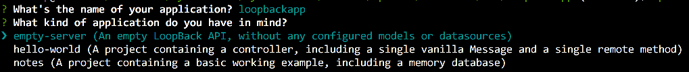
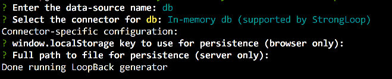
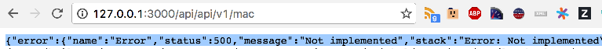

#API Connect Hands-On Labs

##Exercise 4: Generate a LoopBack application and import your APIs

### Prerequisites

Make sure you've met the following prerequisites.

**Prerequisite 1**: Registered for a Bluemix account that is **still current** (trial Bluemix accounts are available at <http://console.ng.bluemix.net>). Contact the instructor for a promotion code for a bump in the quota. Please note down the `username` (or `email`) and `password` which will be used to login via the `cf` CLI.

**Prerequisite 2**: Installed the Cloud Foundry CLI from <https://github.com/cloudfoundry/cli#downloads>.

**Prerequisite 3**: Installed `npm` and `apic`. Refer to instructions from [https://nodejs.org/en/download/] (https://nodejs.org/en/download/) and [https://www.npmjs.com/package/apiconnect] (https://www.npmjs.com/package/apiconnect) respectively.

**Prerequisite 4**: Installed the Hands-On Labs locally. You can either `git clone` [https://github.com/ragsns/apichol] (https://github.com/ragsns/apichol) or download a zip from the repository.

### Ensure that you are in the right sub-directory

Ensure that you are in sub-directory ex4.

```
cd <path-to-hol-folder>/apichol/exercises/ex4
```
### Goals

For this exercise, we'll:

1. Learn about how to create a LoopBack application
2. Learn how to consume an OpenAPI specification shape your LoopBack application's behavior
3. Learn how to implement basic behavior around your imported API design

### [LoopBack API](https://console.ng.bluemix.net/docs/services/apiconnect/apic_003.html#apic_009)


Navigate (cd loopbackapp) to the empty loopbackapp folder within the ex4 directory and execute the following command line syntax:

```
apic loopback
```
You'll want to give your application a name and select the **empty-server** option to create an empty LoopBack API.<br/>  


This should result in a parade of files being generated within the folder that represents a skeleton LoopBack application.  Next, we'll create an in-memory db datastore.

Execute the following command:

```
apic create --type datasource
```

You'll be prompted for a data-source name and type.  Enter **db** and select the default selection of **In-memory db**).  Hit Enter twice.  This will update your applications definition file with this new datasource.



Next, we'll import our OpenAPI specification from exercise 3 to shape this application.  Execute the following command:

```
apic loopback:swagger
```

You'll be prompted for a local path or remote url to your OpenAPI specification file.  You're free to reference your exercise 3 file that was downloaded from editor.swagger.io or the sample one (swagger.json) found in the ex4 parent folder (e.g. **../swagger.json**). 


Next, we'll want to confirm that our datasource is attached to our model.  To do this, let's jump into the API designer by executing the following command:

```
apic edit
```
This should result in the API Designer opening within your default web browser.  Browse to the Models tab ...


and click on our model named `swagger_api_v1`.  This will open the properties view for the model.  Click the dropdown arrow and select the datasource **db**.  Hit the **save icon** in the upper right of the window and then close the browser.


Sweet!  We now have a node application with endpoints defined via our OpenAPI specification.  To test, let's fire up the app:

```
node .
```

We'll observe that the application is listening on port 3000.  Using a browser, let's navigate to the following url:  [http://127.0.0.1:3000/api/api/v1/mac](http://127.0.0.1:3000/api/api/v1/mac) .

Ughh ... a 500 response error.  




Wait, that makes total sense.  We've defined endpoints via the spec but have not actually implemented any logic around the behavior of the resources.  Let's tackle that next. 

Kill the server by hitting control+c and browse to the LoopBack application's model controller file (`./server/models/swagger-api-v-1.js`).  To expedite the implementation, a commented out copy of the generated controller file is provided within the ex4 parent folder named **swagger-api-v-1.js**.  While in the project folder loopbackapp folder, execute the following command to replace the existing controller with an equivalent copy that already has the implementation logic enabled:

```
cp ../swagger-api-v-1.js.uncommented server/models/swagger-api-v-1.js
```

This enables four (4) of the OpenAPI specification entries for 

- **GET** and **POST** on `/mac`
- **GET** and **DELETE** `/mac/{macId}`
 
If you're curious, we've also provided for reference and inspection, an uncommented copy in the ex4 directory. (`../swagger-api-v-1.js.commented`).  

Let's fire up our Loopback Application based on Swagger ... and try to populate it with some data.

```
node .
```
In a separate terminal window, issue the following 2 commands:

```
curl -X POST -H "Content-Type: application/json" -d "{\"organization\":\"IBM Corporation\",\"hex\":\"74:99:75\",\"base16\":\"749975\"}" "http://localhost:3000/api/api/v1/mac"
curl -X POST -H "Content-Type: application/json" -d "{\"organization\":\"IBM Corporation\",\"hex\":\"00:09:6B\",\"base16\":\"00096B\"}" "http://localhost:3000/api/api/v1/mac"
```

Now let's fetch the record associated with an ID=2.  Navigate your browser to [http://localhost:3000/api/api/v1/mac/2](http://localhost:3000/api/api/v1/mac/2)

The result should look similar to this:
(screenshot of result)

Awesome sauce!  You've now walked through the process of quickly creating a REST API Loopback Application derived from an OpenAPI specification.  Next, we'll learn how to easily create a Bluemix MySQL service instance.
