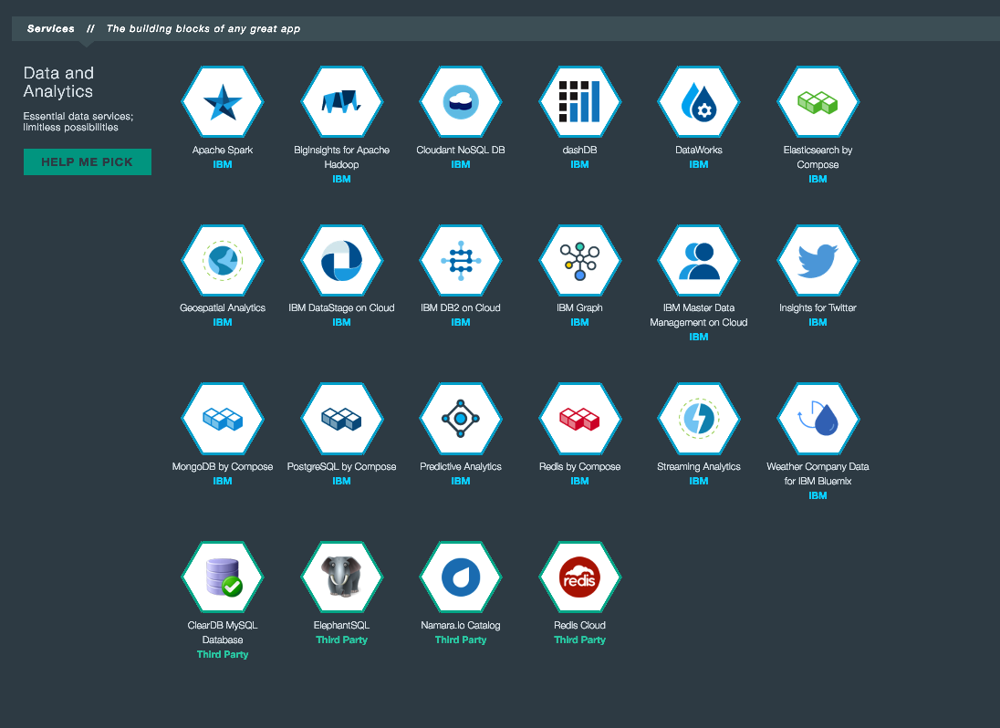

#API Connect Hands-On Labs

##Exercise 4: Create a database service on Bluemix

### Prerequisites

Make sure you've met the following prerequisites.

**Prerequisite 1**: Installed the API Connect toolkit and targeted the Bluemix instance ([Exercise 1](../ex1)).

### Ensure that you are in the right sub-directory

Ensure that you are in sub-directory ex4.

```
cd <path-to-hol-folder>/exercises/ex4
```

### Verify your Target within Bluemix instance

Verify your Target within Bluemix Cloud Foundry instance by issuing the following command. 

```
cf target
```

The output for the `cf` CLI should look something like below.

```

API endpoint:   https://api.ng.bluemix.net (API version: 2.54.0)
User:           <bluemix_email_id>
Org:            <bluemix_email_id>
Space:          dev
 
```
### Overview of Exercise
For this exercise, we seek to learn how to rapidly instantiate a MySQL DB service and populate it with sample data, thus forming an asset for future exercises exploring the creation of database CRUD APIs.

We will use a simple Java application to populate the data that will be accessible via the APIs.

Although the API is based around a simple `employees` database, you can follow similar methods to provide APIs around your more complex and production enterprise Java/Node.js application.

### Creating a database service
 With a Platform as a Service (PaaS) such as IBM Bluemix, DB creation and interaction is super easy -- as you'll see.

IBM Bluemix offers a wide array of data service options that are just a few clicks/commands away.



For this exercise, we'll be instantiating a MySQL database service offered on the Bluemix platform.  MySQL is an open-source relational database management system (RDBMS).

Creating a Bluemix service instantiation requires input of three fields:

- Name of the service offering
- Plan of the service offering
- Instance name of your instantiated service

**Name of the service offering**:<br/>
Defined by the service provider when registering their service with Bluemix.

**Plan of the service offering**:<br/>
Defined by the service provider based on varying levels of quality of service (QoS), resource throttling and price.

**Instance name**:<br/>
Defined by the user.  This will be the canonical name that uniquely identifies this service instantiation.  It is typically used when defining service dependencies within application manifests or Bluemix CLI operations such as service binding.

####Identifying the name and plan of a service offering

Cloud Foundry also offers a listing of the entire service marketplace registered within the PaaS platform.  **Beware, this can be a lengthy query** (~2-5 mins) proportional to the size of the platform catalog.  For this workshop, it neither recommended nor required.  However, for the curious the command is:   

```
cf marketplace
```

The output for the `cf` CLI would look something like below.

```
Getting services from marketplace in org xxx@xxx.xxx / space dev as xxx@xxx.xxx ...
OK

service                                          plans                                                                         description
APIConnect                                       Essentials, Professional*, Enterprise*, Professional 5M*, Enterprise 25M*     Create, manage, enforce, and run APIs.
AdvancedMobileAccess                             Gold*, Bronze*                                                                Finely tune mobile apps with operational analytics, and ensure communications with back end systems are secure.
Application Security on Cloud                    free, standard*                                                               A robust, practical security vulnerability assessment for your web applications.
Auto-Scaling                                     free                                                                          Automatically increase or decrease the number of application instances based on a policy you define.

[....] 
```
As you can see, the first two columns contain 2 out of 3 of parameters that we need.  In particular, there are two MySQL services of interest to us:

- **Cleardb**
- **MySQL** 

While the marketplace command contains both names and plans, there may be times where you know the name of the service and simply want to enumerate the latest plan options. There is a convenient shortcut CLI command to discover only the associated plans.<br/>
**Nota Bene:  This convenience does not extend to services designated as experimental within the catalog**

For example, the command to discover the Cleardb plans are:

```
cf marketplace -s cleardb
```


The output for the `cf` CLI should look something like below.

```
Getting service plan information for service cleardb as xxx@xxx.xxx...
OK

service plan   description                                                                     free or paid
spark          Great for getting started and developing your apps                              free
boost          Best for light production or staging your applications                          paid
shock          Designed for apps where you need real MySQL reliability, power and throughput   paid
amp            For apps with moderate data requirements                                        paid
```

Based on the above commands, we can now discern the key details for both MySQL service providers:

|  Service Provider 	| Service Name 	| Service Plan (Free) 	|
|:-----------------:	|:------------:	|:-------------------:	|
|      ClearDB      	|    cleardb   	|        spark        	|
| MySQL (Community) 	|     mysql    	|         100         	|

At this point, it would seem like we have two options.  Alas! there is another key detail that we absolutely must consider for our use case.

<div style="padding-left: 2em;font-weight:bold">
Whether a service provides a public vs. platform endpoint access of the DB service
</div>

The community provided MySQL service will generate connection urls that contain **private network IPs** only visibile to other platform applications (e.g. IBM Bluemix applications, containers, etc ...).  By contrast, the ClearDB 3rd party MySQL service generates **public internet visible connection urls**.  Public accessibility is the characteristic that we must embrace for our Hands On Lab needs, given that we'd like to connect and populate this DB from our local VM image. Therefore, we will create our MySQL service instance by issuing the following command specific for ClearDB MySQL: 

```
cf create-service cleardb spark workshopmysql
```

The output for the `cf` CLI should look something like below.

```
Creating service instance workshopmysql in org xxx@xxx.xxx / space dev as xxx@xxx.xxx...
OK
``` 

**Congratulations**, you now have a MySQL service instance exclusively for your application and API development needs.  At this point, you may be wondering about discovery of connection information to access this service.  Fear not, we simply need to create a service key credential set for our newly minted MySQL service. We can do this by issuing the following command:

```
cf create-service-key workshopmysql connectioncreds
```

The output for the `cf` CLI should look something like below.

```
Creating service key connectioncreds for service instance workshopmysql as xxx@xxx.xxx...
OK
``` 

Finally, we can examine the generated credentials by executing the following command:

```
cf service-key workshopmysql connectioncreds
```

The output for the `cf` CLI should look something like below.

```
{
 "hostname": "us-cdbr-xxxx-xxxx-36.cleardb.net",
 "jdbcUrl": "jdbc:mysql://us-cdbr-xxxx-xxxx-36.cleardb.net/ad_2xxxxxxxxxxxf?user=b2xxxxxxxxxx7\u0026password=1xxxxxx7",
 "name": "ad_2xxxxxxxxxxxf",
 "password": "1xxxxxx7",
 "port": "3306",
 "uri": "mysql://b2xxxxxxxxxx7: 1xxxxxx7@us-cdbr-xxxx-xxxx-36.cleardb.net:3306/ad_2xxxxxxxxxxxf?reconnect=true",
 "username": "b2xxxxxxxxxx7"
}
```
Armed with this connection information, we are now able to interact with our new MySQL DB.

Let's leverage this newly minted power to populate it with some Employee Data.  If you're curious about the data that we'll insert, check out the `populate.sql` file found within this folder.  You'll see a very long set of VALUES representing basic personnel info like names, birthdate, etc ...:

```
INSERT INTO `employees`
(emp_no, birth_date, first_name, last_name, gender, hire_date)
VALUES      (10001, 
             '1953-09-02', 
             'Georgi', 
             'Facello', 
             'M', 
             '1986-06-26'), 
[....]
```
To make things smoother, we've provided a convenient set of scripts and a CLI Java file that illustrates:

-  Using Java Code with the MySQL Connector jar to connect to an IBM Bluemix db service
-  Using Bash/Shell scripting techniques to harvest db service credentials using the cf CLI

You're encouraged to inspect the **ex4.java**, **setupMySQL.sh** and **svcinspect.sh** files found within this directory that help put these concepts into action.  Assuming that your ClearDB MySQL service is named **workshopmysql**, execute the following command.  Otherwise, substitute your alternate ClearDB MySQL service instance name as appropriate:

```
./setupMySQL.sh workshopmysql
```

The utility execution is broken up into 3 main phases:

-  Service Inspection + Credential Gathering 
-  Java Compilation
-  SQL Updates and Queries

Your output should look similar to:

```
⚒  Welcome to the MySQL Setup Helper Script
⚒  Brought to you courtesy of IBM
⚒  setupMySQL.sh invoked

⚒  Welcome to the Service Inspector ...
👀  Target Instance: workshopmysql
⚒  Interrogating Service Instance for Credentials ...
👀    Service Key Found: connectioncreds
⚒    Parsing Service Key ...
🎁    Service Instance Type: ClearDB
🎁      hostname: us-cdbr-iron-east-04.cleardb.net

[....]

⇌  Fetching commons-cli-1.3.1.jar from http://.../commons-cli-1.3.1-bin.tar.gz
2016-09-15 23:22:22 URL:http://.../commons-cli-1.3.1-bin.tar.gz [305600/305600] -> "commons-cli.tar.gz" [1]
🚚  Compiling Exercise 4 Java Setup, Populate and Query Utility
⏳  Executing utility to see the arguments available ...
usage: ex4 [-d <dbname>] [-h <host>] [-n <port>] [-p <password>] [--query]
       [-s <sql>] [-u <username>] [-w <wanthelp>]
       Options, flags and arguments may be in any order

[....]

Updating target MySQL DB ...
0
🎁  Employees Table Created

[....]

Updating target MySQL DB ...
1000
🎁  Employees Table Populated

[....]

Querying target MySQL DB ...
10001  1953-09-02  Georgi  Facello  M  1986-06-26
10002  1964-06-02  Bezalel  Simmel  F  1985-11-21
10003  1959-12-03  Parto  Bamford  M  1986-08-28
10004  1954-05-01  Chirstian  Koblick  M  1986-12-01

[....]
```
For the curious, the utility intentionally generates and persists a resultSet of the records in a tab delimited (*.tsv) file within this directory for your perusal.

Sweet! That's it!  We can all agree, that was pretty simple to standup a MySQL DB and get it populated.  

### Summary of exercise and next steps

We started with a goal of instantiating a MySQL DB and getting it populated with some sample data.  We learned about available IBM Bluemix DB services, the required details for creating a MySQL DB instance and the use of a simple Java program that consumes the generated credentials to facilitate connecting and populating the new MySQL DB instance.

In [Exercise 5](../ex5), we will dive into creation of database CRUD APIs that leverage this just populated DB.
