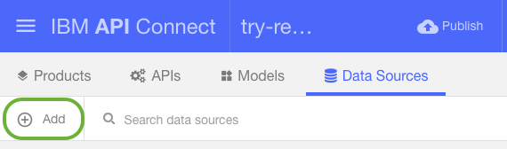
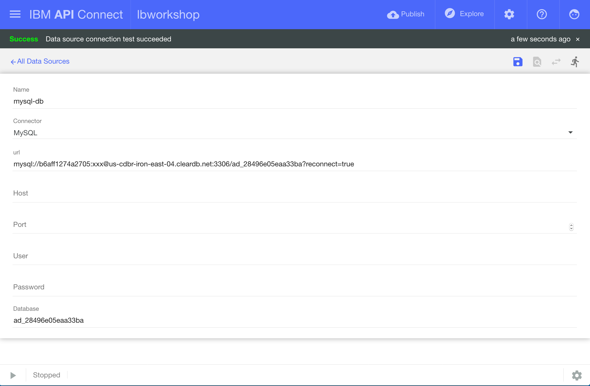
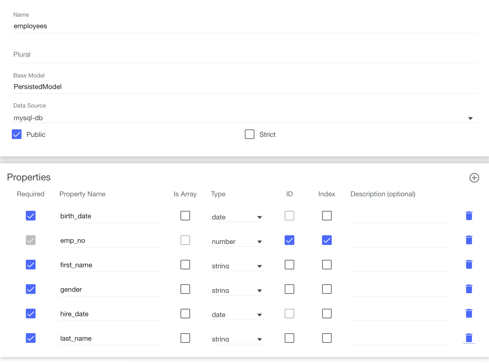

# API Connect Hands-On Labs

## Exercise 5: Create database CRUD APIs with LoopBack models

### Prerequisites

To run through this exercise, you will need to have done the following steps:

**Prerequisite 1**: Installed the API Connect toolkit ([Exercise 1](../ex1)).

**Prerequisite 2**: Generated a LoopBack app ([Exercise 3](../ex3)).

**Prerequisite 3**: Created a database service on Bluemix and connected it to your LoopBack app ([Exercise 4](../ex4)).

### Overview of Exercise

In this exercise we will create simple CRUD-based APIs around the `employees` database.

### Ensure that you are in the LoopBack application directory

Ensure that you are in the LoopBack directory you created in [Exercise 3](../ex3)

```
cd <path-to-hol-folder>/apichol/exercises/ex4/loopbackapp
```

### Launch the API Connect Designer (Developer toolkit)

The API Connect Designer is a GUI that allows developers to graphically create and manage their APIs. 

```
apic edit
```

After a brief pause, the following message is displayed.

`Express server listening on http://127.0.0.1:9000`

The API Designer opens in your default web browser. If it prompts you to login, use your IBM Bluemix credentials.

### Create a database connection

Click on the Data Sources tab. Hit the "Add" button, and choose name for your database - "mysql-db".



In the connector tab, choose "MySQL". It'll prompt you to install the connector; simply follow the prompts.


**If the previous step did not work, continue with this step. Otherwise, proceed below.**

**Work-Around**: If you saw an error, switch back to your terminal. Use `Ctrl+C` to end the `apic edit` instance. This shuts down the API Designer Toolkit.  Then, type the command `npm i --save loopback-connector-mysql` to manually install the LoopBack connector for MySQL databases. Then, run `apic edit` again, switch to the `Databases` tab, open your `mysql-db` entry, and continue below.

Enter the database credentials you noted in [Exercise 4](../ex4). Enter the `uri` credential into the `url` field and your `name` credential into the `Database` field. 



Hit the Save button on the top-right. This should test your database connection and alert you if your credentials are incorrect or if the connection was unable to be made.

### Create Models to work with your database

Let's create a model so that you're able to perform CRUD (Create/Read/Update/Delete) operations against your MySQL database. Go to the Models tab and add a new model by clicking the add button. Name it `employees`.

Choose the `mysql-db` Data Source, and enter the following properties:



We are about to create a LoopBack model representation of the MySQL database. The name of the model `employees` refers to the table name in the MySQL database. The various property names refer to the MySQL "fields". The types translate to MySQL fields -- for example, `String` to `VARCHAR`. `Key` in LoopBack is similar to `Key` in MySQL.

Hit the `Save` button on the top right to create the model. That's it! Once a model is created, the APIs to represent that model are automatically generated for you.

### Summary and next steps

We just created APIs around the `employees` database.

In the next exercise, we will test your new APIs by starting the LoopBack application locally and use an interactive OpenAPI explorer to call your APIs!

Next up, Exercise 6: [Test, Explore and Deploy your LoopBack application](../ex6)
