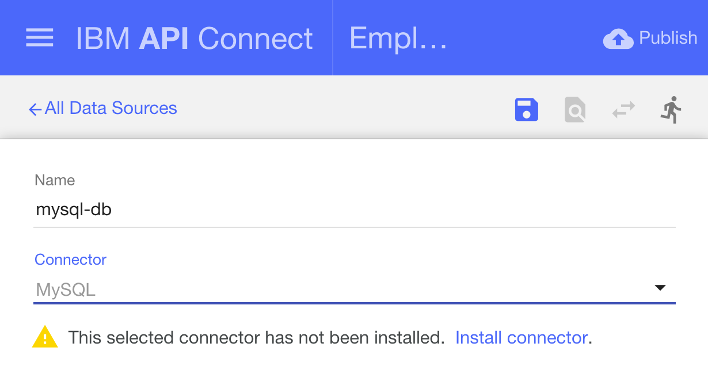
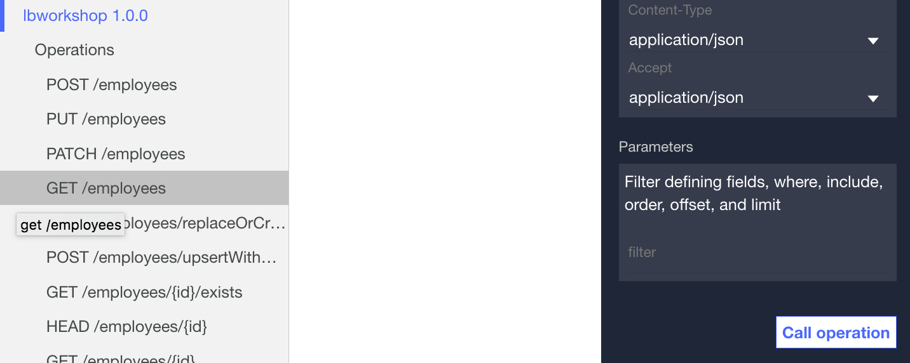

# API Connect Hands-On Labs

## Exercise 6: Create database CRUD APIs with LoopBack models

### Prerequisites

To run through this exercise, you will need to have done the following steps:

**Prerequisite 1** Installed the API Connect toolkit ([Exercise 2](../ex2))

**Prerequisite 2** Generated a LoopBack app ([Exercise 4](../ex4))

**Prerequisite 3** Created a database service on Bluemix and connected it to your LoopBack app ([Exercise 5](../ex5))

### Ensure that you are in the LoopBack application directory

Ensure that you are in the LoopBack directory you created in [Exercise 4](../ex4)

```
cd <path-to-loopback-folder>
```

### Launch the API Connect Designer (Developer toolkit)

The API Connect Designer is a GUI that allows developers to graphically create and manage their APIs. 

```
apic edit
```

After a brief pause, the following message is displayed.

`Express server listening on http://127.0.0.1:9000`

The API Designer opens in your default web browser. If it prompts you to login, use your IBM Bluemix credentials.

### Create a database connection

Click on the Data Sources tab. Hit the "Add" button, and choose name for your database - "mysql-db".


In the connector tab, choose "MySQL". It'll prompt you to install the connector; simply follow the prompts.



Enter the database credentials you noted in [Exercise 5](../ex5). Enter the `uri` credential into the `url` field and your `database` credential into the `Database` field. 

Hit the Save button on the top-right. This should test your database connection and alert you if your credentials are incorrect or if the connection was unable to be made.

### Create Models to work with your database

Let's create a model so that you're able to perform CRUD (Create/Read/Update/Delete) operations against your MySQL database. Go to the Models tab and add a new model by clicking the add button. Name it `employees`.

Choose the `mysql-db` Data Source, and enter the following properties:



That's it! Once a model is created, the APIs to represent that model are automatically generated for you.

### Next steps

In the next exercise, we will test your new APIs by starting the LoopBack application locally and use an interactive OpenAPI explorer to call your APIs!

Next up, Exercise 7: [Test, Explore and Deploy your LoopBack application](../ex7)
