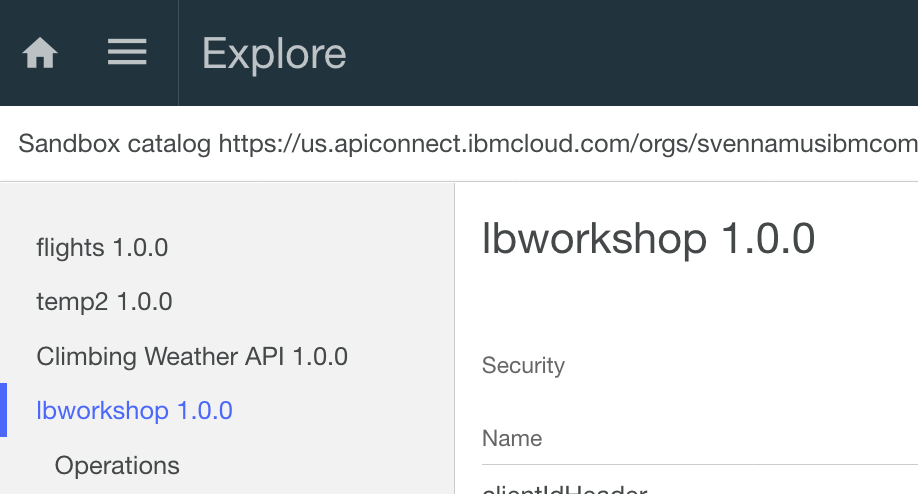
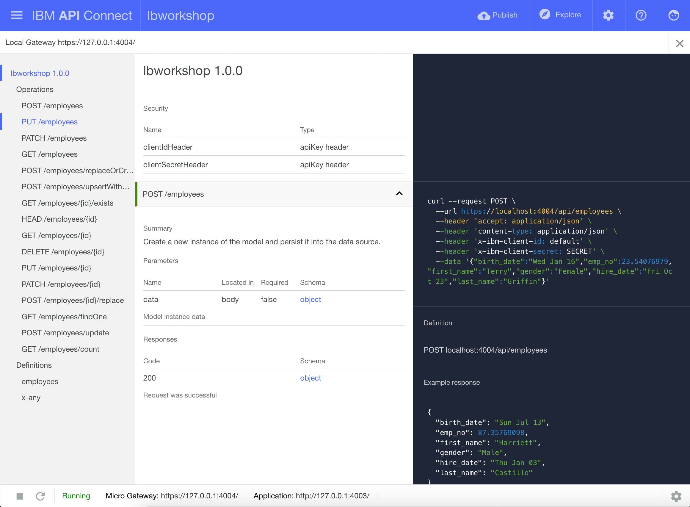
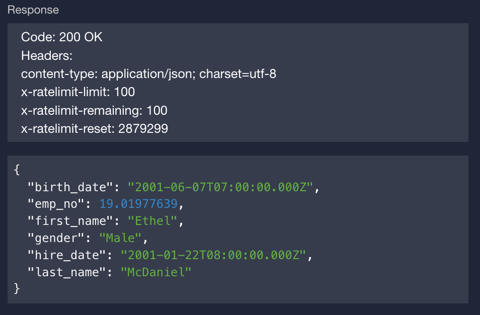
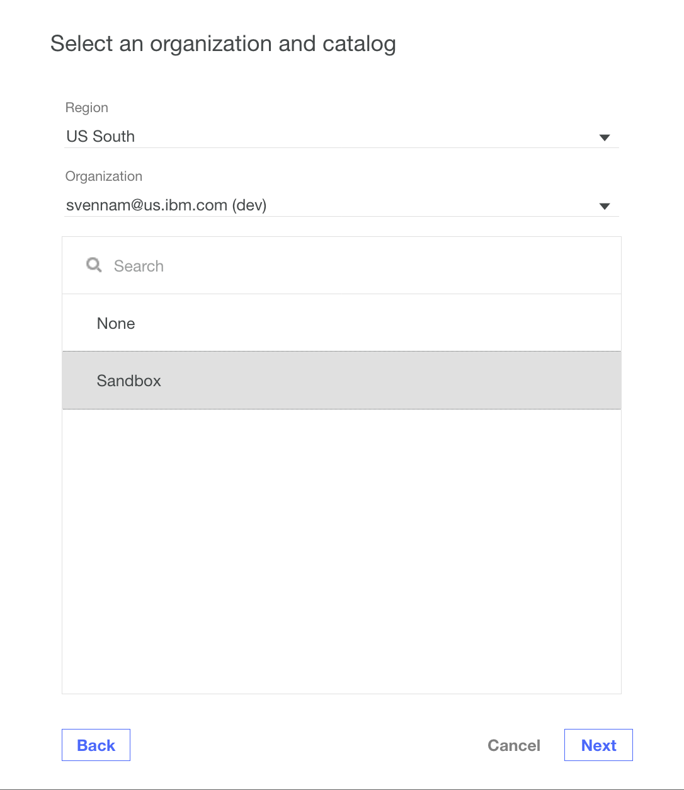
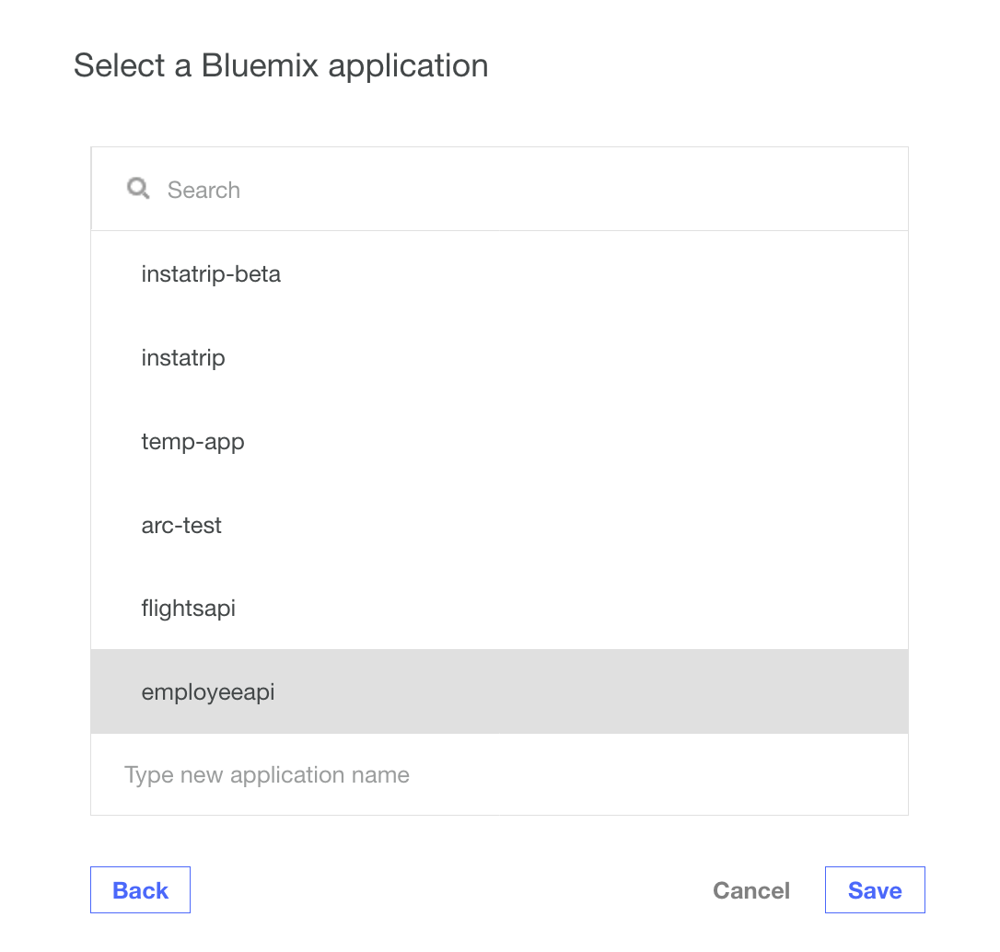

# API Connect Hands-On Labs

## Exercise 7: Test, Explore and Deploy your LoopBack application

### Prerequisites

To run through this exercise, you will need to have done the following steps:

**Prerequisite 1** Installed the API Connect toolkit ([Exercise 1](../exercises/ex1))

**Prerequisite 2** Generated a LoopBack app ([Exercise 4](../exercises/ex4))

**Prerequisite 3** Created a database service on Bluemix and connected it to your LoopBack app ([Exercise 5](../exercises/ex5))

**Prerequisite 4** Created database CRUD APIs in the API Designer ([Exercise 6](../exercises/ex6))

### Ensure that you are in the LoopBack application directory

Ensure that you are in the LoopBack directory you created in [Exercise 2](exercises/ex2)

```
cd <path-to-loopback-folder>
```

### Launch the API Connect Designer (Developer toolkit)

The API Connect Designer is a GUI that allows developers to graphically create and manage their APIs. 

```
apic edit
```

After a brief pause, the following message is displayed.

`Express server listening on http://127.0.0.1:9000`

The API Designer opens in your default web browser. If it prompts you to login, use your IBM Bluemix credentials.

### Start your LoopBack application

On the bottom left of the API Designer, hit the `Play` button to start your application. After a short delay, your application will change to "Running", and you should see two links: Micro Gateway and Application.  



The application link corresponds to the LoopBack application you created in the earlier exercises. It hosts the CRUD APIs you created in [exercise 6](../exercises/ex6). The Micro Gateway link corresponds to a fully-featured API gateway which proxies requests to your LoopBack application, allowing you test your gateway policies.

### Test and Explore your Swagger-based APIs

Now that the application is running, let's try calling some of the APIs!

On the top right of the `API Designer`, hit the `Explore` button. This takes you to an API Explorer, allowing you to explore the APIs defined in your generated Swagger doc.



Along the left side, you should see a number of operations for the `Employee` model you created in [exercise 6](../exercises/ex6). Let's try calling a series of these operations.

#### GET /Employees

Let's test retrieving the list of Employees.

Navigate to the operation `GET /Employees`. Along the right side, there is a black section which shows you how to call that operation, provides boiler code, and has a button "Call Operation". Hit the button to call your GET operation.


You should see a `200 OK` response, along with a large list of employees in the database!


#### POST /Employees

Let's test adding an employee to the database.

Navigate to the operation `POST /$Employees` to create a database entry. Scroll down to the "Call Operation" button, enter some data into the Parameters section (or use the `Generate` button), and hit call Operation.


You should see a `200 OK` response, as well as a response body indicating that the database update has succeeded.



### Deploy your APIs to IBM Bluemix

Once you're happy with the APIs you've created, you can push them the Bluemix, IBM's PaaS (Platform as a Service).  Bluemix will host your APIs and allow you to graphically manage them.

Start by hitting the Publish button on the top right of the API Designer.

Choose `Add and Manage Targets` and `Add IBM Bluemix target`.

Ensure that the organization is correct -- it should correspond to your Bluemix email.  Choose the `Sandbox` catalog.



Type a new application name: `EmployeeAPI`. Then hit the `(+)` button, and hit `Save`.



You've now created a publish target; deploy to it by hitting the `Publish` button and choosing the target you just created.


Choose both `Publish Application` and `Stage or Publish` products. Hit `Publish`. That's it! Your APIs are now securely pushed to the cloud.


### Next steps

In the next two exercises, we'll explain how you can test your APIs and create a developer portal so others can consume your APIs.

Next up, Exercise 8: [Explore your deployed APIs with the API Manager on Bluemix](../exercises/ex8)
