#API Connect Hands-On Labs

##Exercise 8: Tour A - Create a Weather API using API Connect on Bluemix

### Prerequisites

**Prerequisite 1**: Installed the API Connect toolkit ([Exercise 1](../ex1)).

### Overview of exercise

In this exercise, we will now look at how to use the API Connect service as a service on Bluemix. The service provides an API connect manager which provides the same tasks that were available via the API Connect GUI locally, but on the cloud. We will primarily follow the "Getting Started Tour" in this and the following exercise.

The service also enables publication of the APIs to a developer portal which will be covered in the subsequent exercise.

### Login to Bluemix and instantiate the API Connect Service

Login to Bluemix by providing the credentials that you used during the registration process.

<!---->

Once logged in, click on `Catalog` tab.

<!--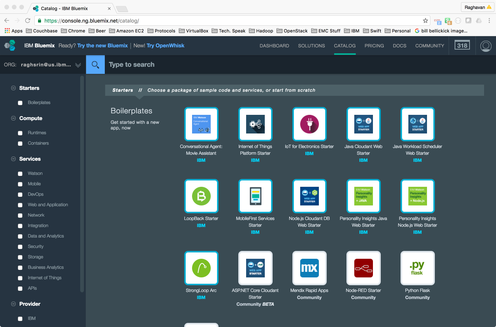-->

Pick the API Connect service tile

<!---->

Pick the defaults for the service

<!---->

You will presented tith a Drafts API screen that looks like below.

<!--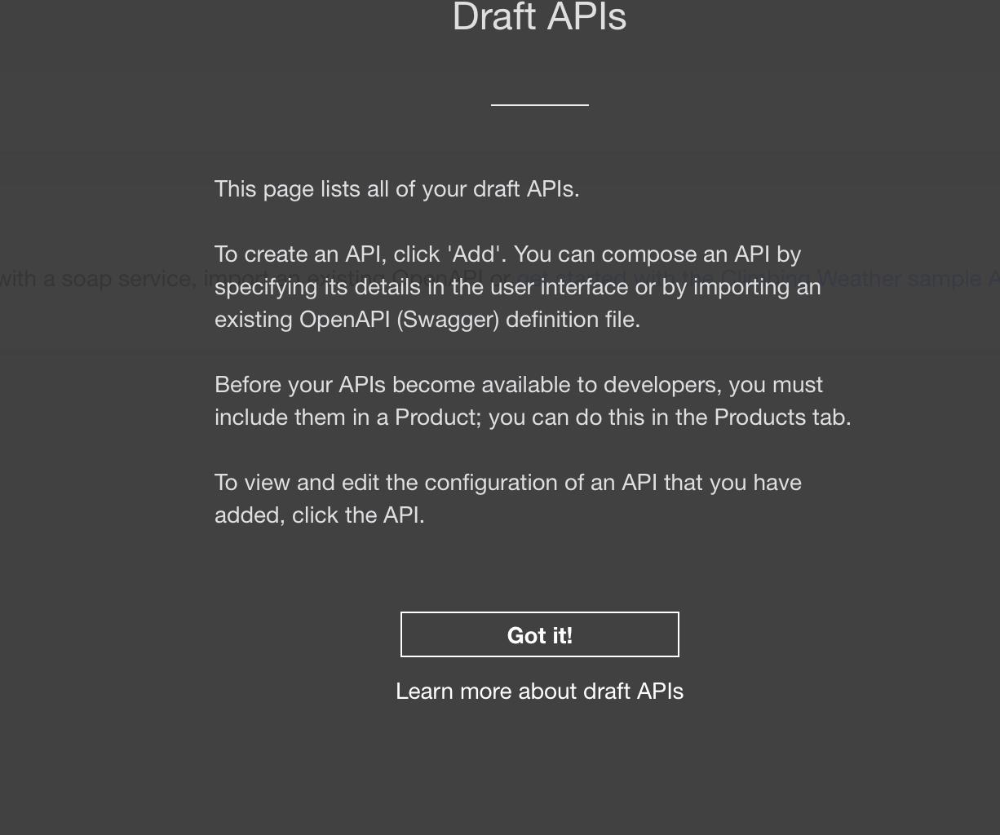-->

Click on "Got it" and proceed.

You will be presented with the Drafts screen that looks like below with the `Getting Started` window on the top right as shown below.

<!--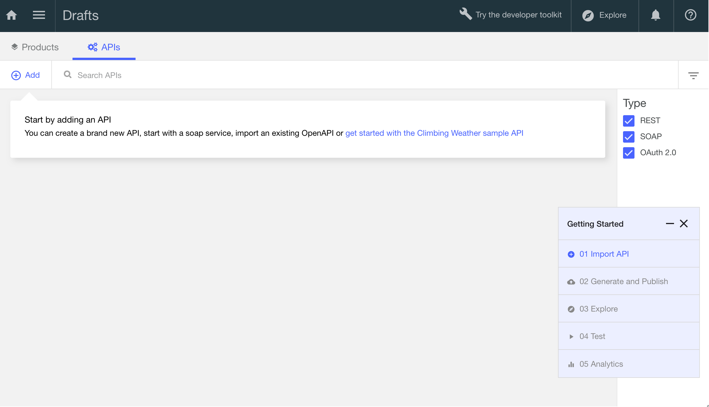-->

If you do not see the "Getting Started" window at any time, **click on ? and "Turn on Guided Tour"** as shown below.

<!--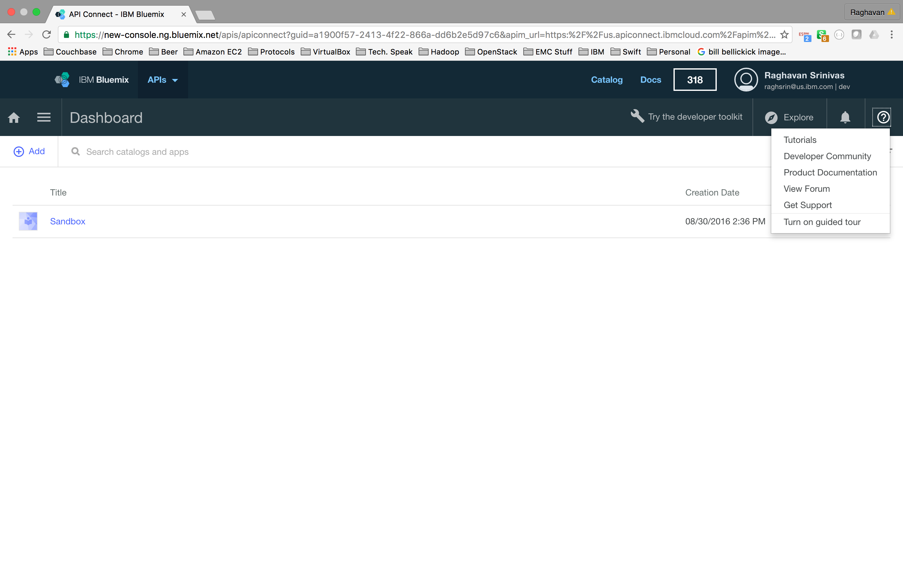-->

We will follow the "Getting Started" tour essentially from now on.

### A tour of the API Connect Manager via the sample Weather API

We start off by clicking on "Import API" in the "Getting Started" window and "Import a Sample API" as prompted.

As indicated before, if you do not have the `Getting Started` window on top right, **click on ? and "Turn on Guided Tour"**

<!--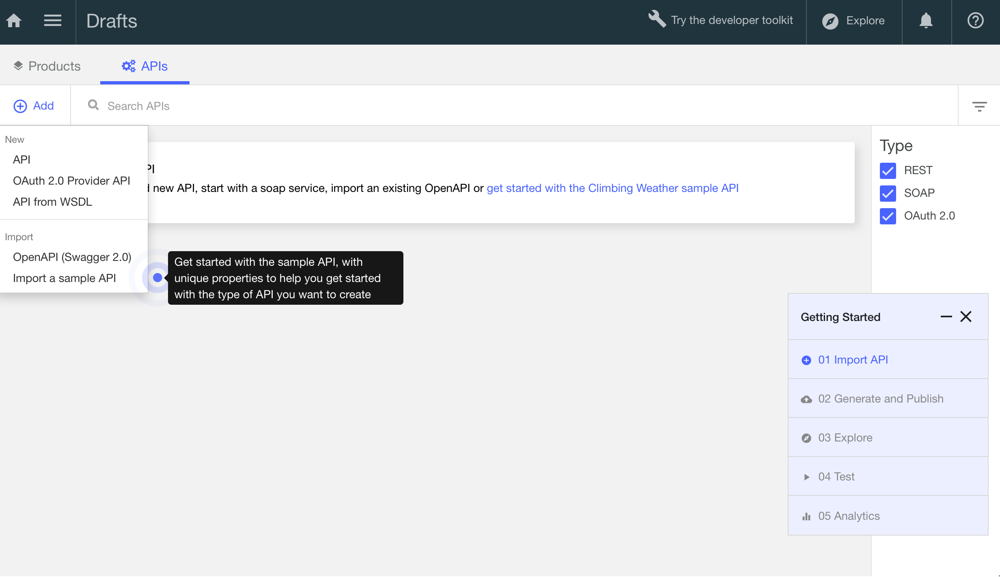-->

In the Dialog box shown below pick the "Climbing Weather" project and hit "Import" as shown below.

<!--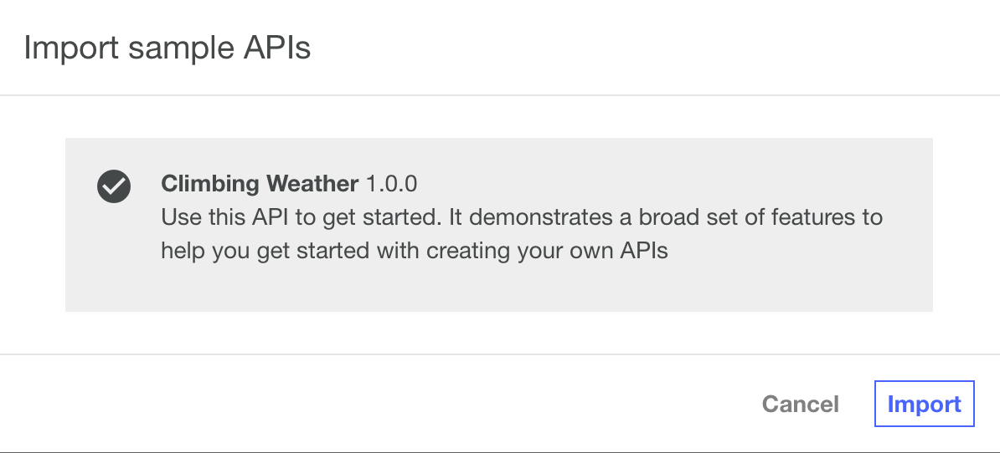-->

This will prompt you about the "API Editor" as shown below. Hit "Got it!".

<!---->

This will bring up the Design view similar to what you saw earlier, this time on Bluemix.

<!--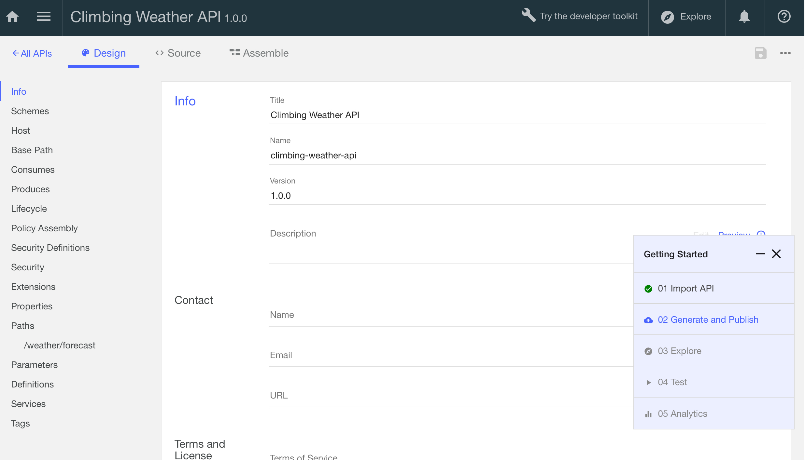-->

Scroll down to the `getWeather` method which looks like below.

<!--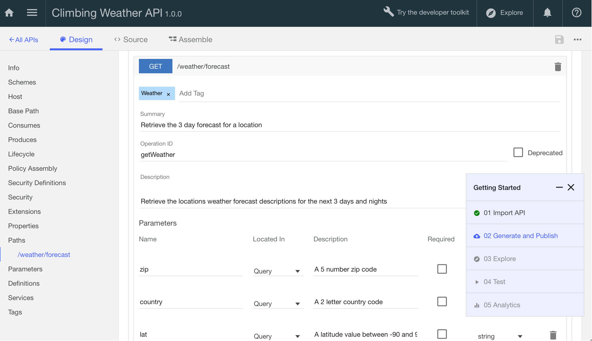-->

Click "Generate and Publish" in the "Getting Started" window picking "Generate a Default Product" as shown below.

<!--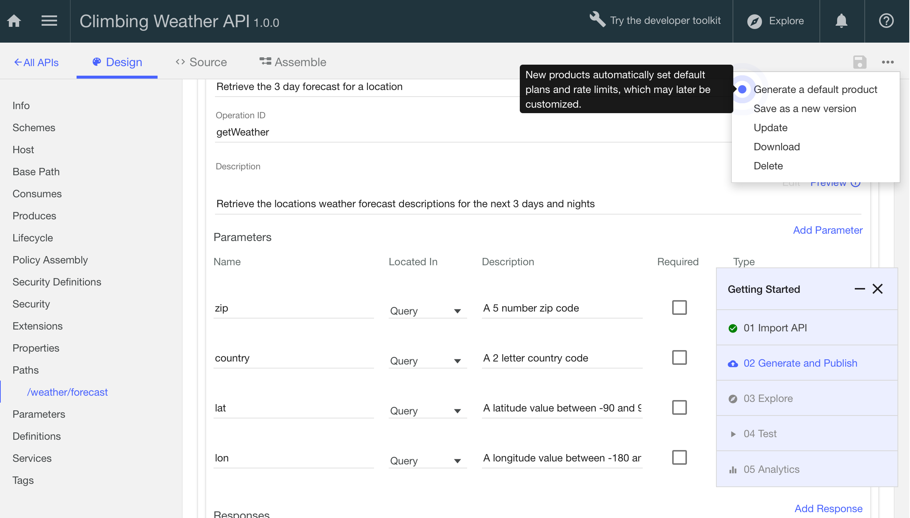-->

You will see that a default plan will be used and that you will publish the product to the Sandbox catalog. Click on "Generate" as shown below.

<!--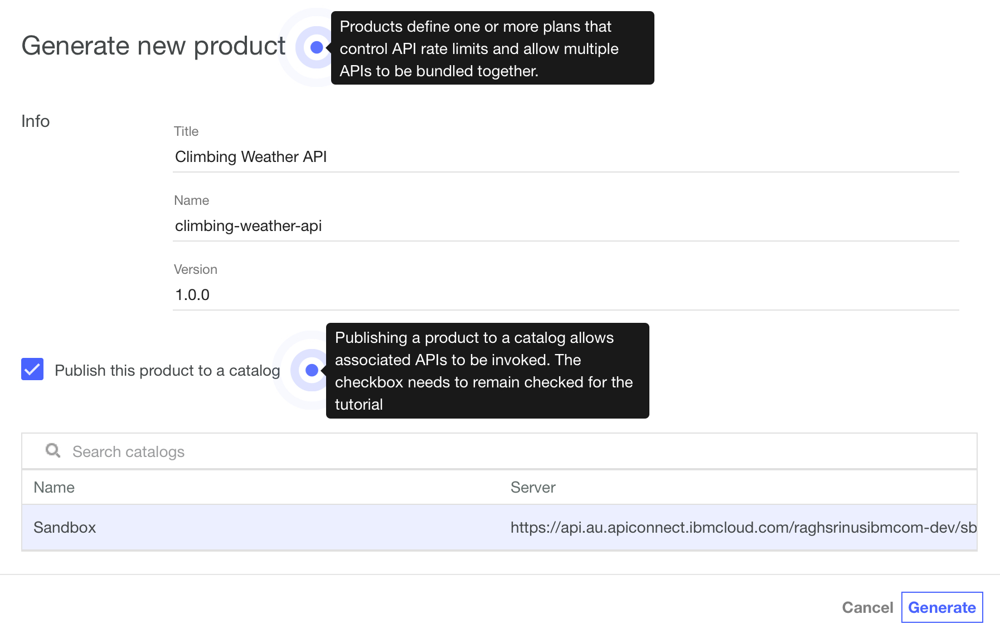-->

Next, click "Explore" in the "Getting Started" window as shown below.

<!---->

Pick "Sandbox" as prompted and as whown below.

<!---->

You will see the sample API as shown below.

<!---->

We will invoke the API by providing the following APIs to country code and zip. Feel free to substitute values.

<!---->

If the call succeeds, you should see a response that looks like below with the weather data for the country and zip code.

<!--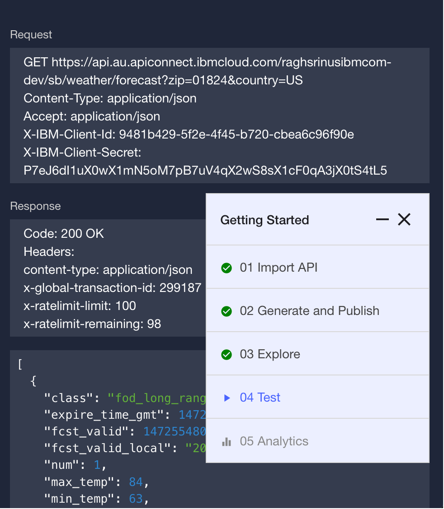-->

If the call fails as shown below, click on the link and accept the certificates (we're overriding the Cross-Origin Resource Sharing - CORS error)

The following screen shots walks through how to ovveride this via a series of dialog boxes. This might be different based on the browser, the URL and the error but is illustrated below

<!--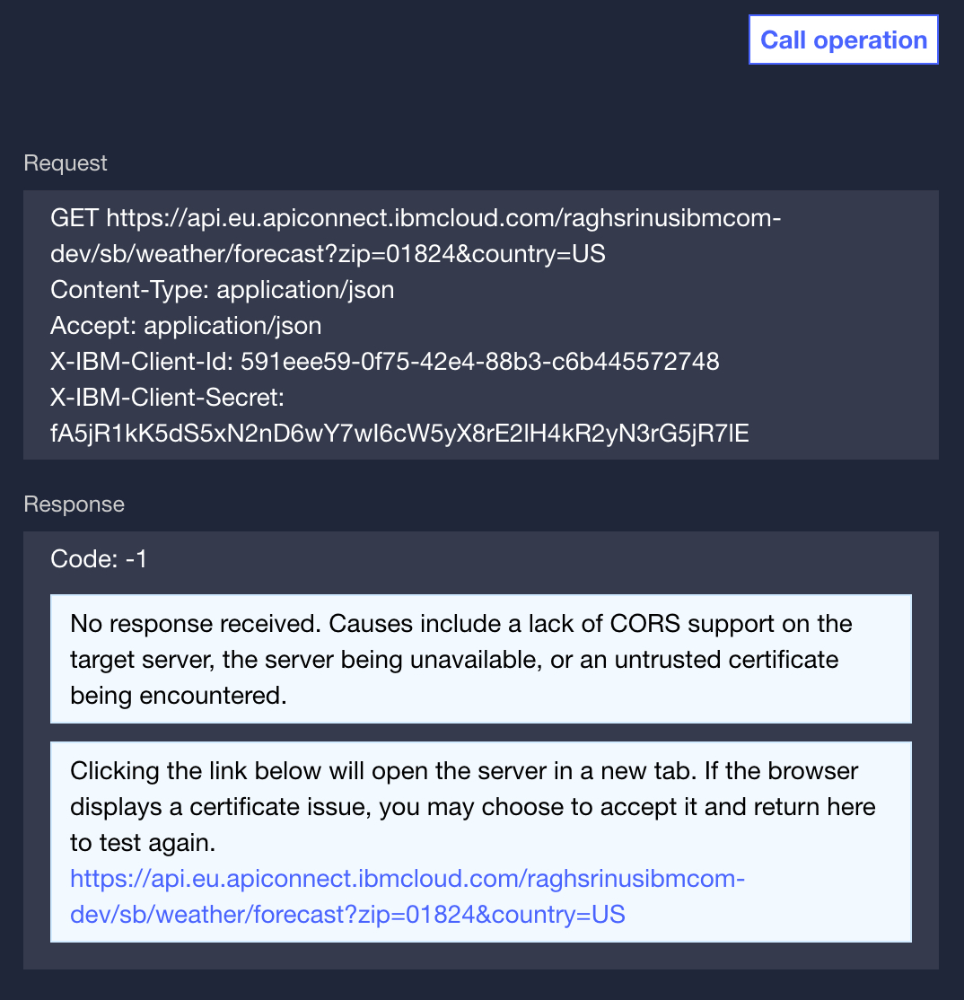-->

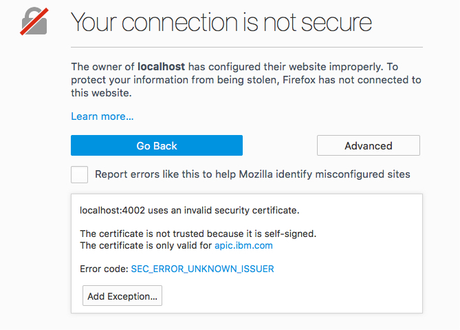

You can click "Test" on the "Getting Started" window and finally on "Analytics" which should result in something like below.

<!--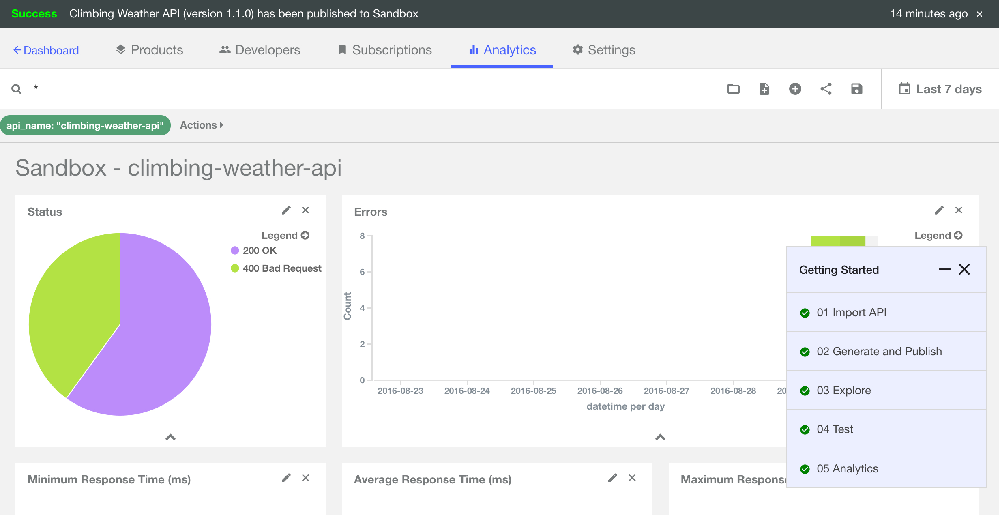-->

Which should show the usage statistics for the product.

### Summary of exercise and next steps

We started with the API connect product locally in an exercise and looked at how to use the same service on Bluemix via the Sample. In a later exercise, we will publish the product to a developer portal that is an adjunct service with the API connect service on Bluemix.

In the next exercises, we'll create a developer portal so others can consume your APIs.

Next up, Exercise 9: [Generate a Developer Portal for your APIs](../ex9)
